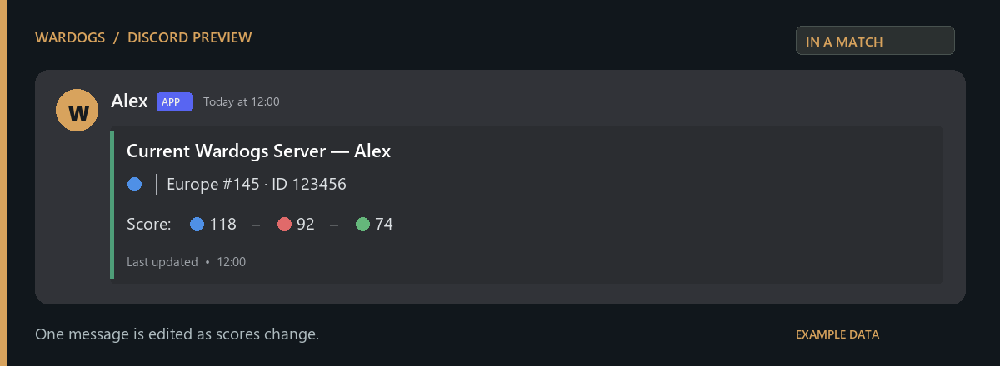
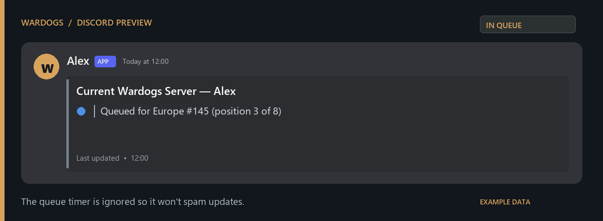
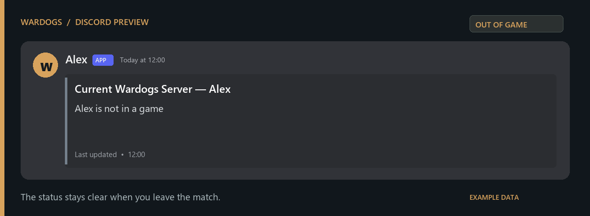
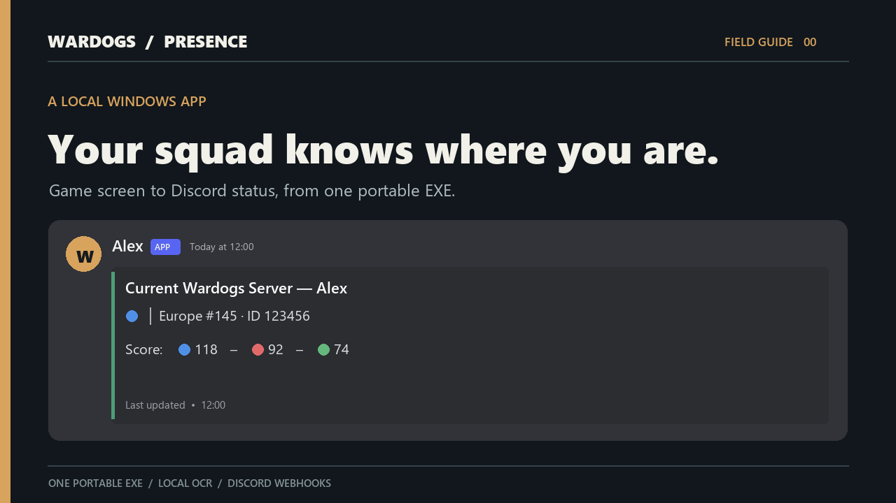
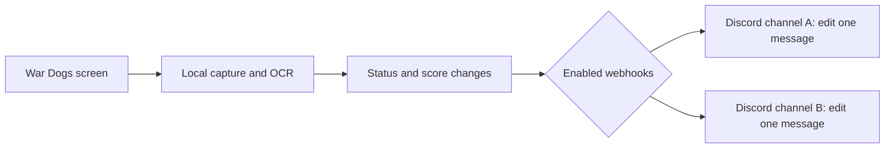

# WARDOGS Presence

A local Windows desktop app that reads your War Dogs status from the game screen and updates a message in each Discord channel you choose. Built with Electron, React, a Python OCR engine, and bundled Tesseract. The downloadable release is **one portable EXE**; players need no Node, Python, OCR installation, or local server.

## Download and use

Download `WardogsPresence-*-win-x64.exe` from [Releases](https://github.com/THEROCKSSS/wardogs-presence/releases), then read the [player guide](docs/GETTING-STARTED.md). The same guide is available as **How it works** inside the app. A [web guide](https://therocksss.github.io/wardogs-presence/) is included in this repository.

## See it in action

These are **illustrative previews with fictional names and server details**, rendered from the app's message-building code. Discord's emoji and spacing may differ slightly on your device. The app creates one message per enabled webhook and edits that message as your status changes.

**In a match** — server and faction scores:



**In queue** — target server and queue position:



**Out of game** — a clear status after leaving:



[](https://therocksss.github.io/wardogs-presence/media/setup-guide.mp4)

**[Watch the narrated setup demo](https://therocksss.github.io/wardogs-presence/#demo)** · [Read its transcript](docs/media/VIDEO-TRANSCRIPT.md). The walkthrough shows downloading the EXE, creating Discord webhooks, calibrating the three reading zones, and starting the watcher. All visuals use example data.

## How it works



The watcher reads the selected screen locally while the game is running. It sends status text to enabled Discord channels, keeps independent message state for each webhook, throttles score updates, and honors Discord retry delays. Your screenshots are not uploaded by the app. The interface and OCR engine are bundled inside the portable EXE; the app does not need an MCP server or a local web server to run.

Your webhook URLs and calibration settings are saved in `%APPDATA%\WardogsPresence\config.json`. Treat that file as a secret. The app sends status text to enabled Discord webhooks; screen captures remain local. Optional server directory enrichment is off by default.

## Features

- Save multiple webhook destinations; enable one or several at a time.
- Each destination keeps its own message and rate-limit retry state.
- Capture a game frame, drag the three reading zones, and inspect OCR output.
- Pause the watcher without deleting settings.
- Local React interface with an in-app setup and troubleshooting guide.

## Build from source (Windows)

Requirements: Node.js/npm, Python 3.13, and a local Tesseract OCR installation with English data. `packaging/WardogsPresence.spec` uses `C:\Program Files\Tesseract-OCR` by default; set `TESSERACT_SRC` to another installation directory if needed. The build checks that Tesseract and the frozen engine actually run.

```powershell
py -3.13 -m venv .venv
.venv\Scripts\python -m pip install -e ".[dev]"
.venv\Scripts\python packaging\build_desktop.py
```

The result is `dist/WardogsPresence-<version>-win-x64.exe`. Electron Builder's portable target packs its runtime, React assets, Python engine, and Tesseract resources into that single download. It extracts to a temporary directory at launch and keeps user settings under AppData. The UI uses bundled files; it does not run a local HTTP server.

For interface development, use `npm ci` in `frontend/`, then `npm run dev`. The browser preview has disabled device controls. Build the engine with the build script, then run `npm run desktop` from the repository root to exercise the native bridge.

## Contributing and security

Issues and pull requests are welcome. Do not post webhook URLs, screenshots containing personal data, or `%APPDATA%\WardogsPresence` files in issues. Run `.venv\Scripts\python -m pytest tests -q` and `npm run build` in `frontend/` before opening a PR. See [SECURITY.md](SECURITY.md) for private vulnerability reports.

## Credits and license

The game screen parsing approach derives from [msmcpeake/wardogs-discord-status](https://github.com/msmcpeake/wardogs-discord-status) (MIT). See [NOTICE](NOTICE) for attribution. This project is MIT licensed; bundled Tesseract is Apache 2.0 licensed.
